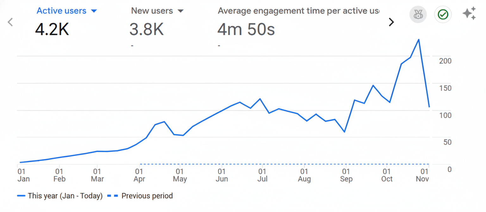
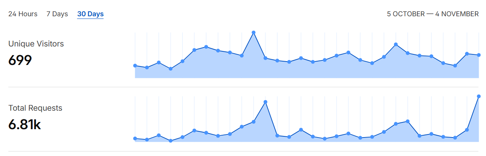

<div align="center">
  
  <h1>QRent</h1>

<a href="https://www.qrent.rent"></a>
<a href="https://github.com/wiperi/qrent/blob/main/LICENSE"></a>
<a href="https://github.com/wiperi/qrent/issues"></a>

</div>

[English](./README.md) | 简体中文

## 关于 QRent

QRent 是一个专为澳大利亚国际学生打造的 AI 驱动租房平台。通过分析通勤时间、预算和区域数据，帮助学生更智能、更快速地找到最合适的租房——一站式完成。

## 我们的成长

今年，我们实现了 **4.2K 活跃用户**和超过 **10K 页面浏览量**。在租房旺季期间，我们的日活跃用户达到 **200+**，月活跃用户达到 **1,500+**。

<div align="center">



</div>

## 核心功能

- **AI 驱动的推荐系统**：站在国际学生的视角，基于通勤时间、预算、生活方式和租赁成功率对房源进行评分和推荐。接下来，我们将专注于打造 agentic 辅助下的租房体验，尽可能减少信息不对称带来的租房困难。

- **定制化体验**：我们专注于为澳大利亚的国际学生提供量身定制的信息服务，确保每个用户都能找到最适合自己的住所。我们将持续拓展服务领域，目标是提供端到端的解决方案。

- **智能筛选**：通过智能搜索和筛选选项，用户可以根据学校位置快速缩小房源范围，找到最符合需求的房源。

- **一站式体验**：我们聚合全网优质房源信息，让用户在一个平台上比较、筛选和预订，无需在多个网站之间切换。我们将持续拓展房源渠道，提升用户体验。

## 快速开始

### 环境要求

在开始之前，请确保已安装以下环境：
- **Node.js** 20 或更高版本
- **pnpm** 8 或更高版本
- **Docker**（可选，用于运行后端依赖服务）

根据您的需求，有两种主要的开发方式。

### 方式一：仅开发前端

此方式使用线上后端 API，非常适合仅进行前端开发。

1. **配置环境变量**：
   在项目根目录创建 `.env` 文件并填入以下内容，这样前端将使用线上后端 API：
   ```bash
   NEXT_PUBLIC_BACKEND_URL=https://api.qrent.rent
   ```

2. **安装依赖**：
   ```bash
   pnpm install
   ```

3. **构建前端**：
   ```bash
   pnpm --filter packages/frontend build # 等同于 cd packages/frontend && pnpm build
   ```

   > 这将首先生成 Prisma 客户端代码，构建后端项目，然后构建前端以获得 tRPC 所需的类型信息。

4. **运行开发服务器**：
   ```bash
   pnpm --filter packages/frontend dev
   ```

### 方式二：全栈开发

此方式在本地同时运行前端和后端。

1. **配置环境变量**：
   在项目根目录创建 `.env` 文件并配置后端相关字段。参考 `.env.example`：
   ```bash
   cp .env.example .env
   ```

   编辑 `.env` 文件，至少填写数据库、后端和 Redis 相关字段。

2. **启动后端服务**：

   **使用 Docker**：
   ```bash
   docker compose up -d db redis
   ```

   > 只启动除后端服务本身外的所有服务，这些是后端依赖的服务。

   **不使用 Docker**：
   手动安装并启动 `docker-compose.yml` 中定义的除后端服务外的所有服务，然后在 `.env` 中配置它们的连接信息。

3. **安装依赖**：
   ```bash
   pnpm install
   ```

4. **生成 Prisma 客户端**：
   ```bash
   pnpm --filter packages/shared db:generate # 生成 Prisma 客户端代码和类型定义
   pnpm --filter packages/shared db:push # 同步数据库架构
   ```

5. **运行后端**：
   ```bash
   pnpm --filter packages/backend dev
   ```

   如果成功，您应该看到：
   ```
   > @qrent/backend@1.0.0 dev /home/wiperi/qrent/packages/backend
   > NODE_ENV=development ts-node-dev -r tsconfig-paths/register -T src/server.ts

   [INFO] 00:19:50 ts-node-dev ver. 2.0.0 (using ts-node ver. 10.9.2, typescript ver. 5.8.2)
   🔄 Loading: /home/wiperi/qrent/.env
   ⚡️ Server started on port 3201 at 0.0.0.0
   You have 0 users in your database
   You have 0 properties in your database
   ```

6. **运行前端**（在新终端中）：
   ```bash
   pnpm --filter packages/frontend dev
   ```

查看终端输出以了解前后端的端口号。

## 文档

- **[API 文档](https://0gqqgjlydk.apifox.cn)** - 后端 API 参考（REST 版本，与 tRPC 效果相同）

## 社区

欢迎来自社区的贡献和讨论！

- **报告问题**：发现 Bug？[提交 Issue](https://github.com/wiperi/qrent/issues)
- **讨论**：有问题或想法？发起[讨论](https://github.com/wiperi/qrent/discussions)
- **邮箱**：如需合作或一般咨询，请通过此[邮箱](mailto:solidtreepassing@gmail.com)联系我们

## 贡献指南

欢迎为 QRent 做出贡献！我们遵循 [Conventional Commits](https://www.conventionalcommits.org/) 规范编写提交信息。

### 提交信息格式

每条提交信息包含**类型**、**范围**（可选）和**主题**：

```
<type>(<scope>): <subject>

示例：
feat(frontend): 添加房源对比功能
fix(backend): 修复 JWT token 过期问题
docs: 更新 README 中的安装说明
chore(deps): 更新依赖
```

### 常见类型：
- `feat`：新功能
- `fix`：Bug 修复
- `docs`：文档变更
- `style`：代码格式变更（格式化、分号等）
- `refactor`：代码重构
- `test`：添加或更新测试
- `chore`：维护任务、依赖更新

### 新手友好的 Issue

刚接触项目？查看标记为 [`good first issue`](https://github.com/wiperi/qrent/labels/good%20first%20issue) 的 Issue——这些是新手熟悉代码库的好起点。

贡献之前，请：
1. Fork 仓库
2. 创建特性分支（`git checkout -b feat/amazing-feature`）
3. 按照提交信息格式提交更改
4. 推送到您的分支（`git push origin feat/amazing-feature`）
5. 创建 Pull Request

## 技术栈

- **前端**：Next.js 15、React 19、Tailwind CSS v4、tRPC
- **后端**：Node.js、Express、tRPC、Prisma ORM
- **数据库**：MySQL 8.0
- **缓存**：Redis
- **爬虫**：Python with Playwright
- **Monorepo**：pnpm workspaces

## 许可证

本项目采用 **非商业许可证（NCL 1.0）**。

您可以出于非商业目的使用、复制、修改和分发代码。任何商业用途需要从维护者处获得单独的商业许可证。详见 [LICENSE](./LICENSE)。

**注意**：该许可限制商业使用，因此不符合 OSI 的"开源"定义；本项目以"源代码可用（非商业）"的方式发布。若需商业授权，请联系仓库维护者。

---

<div align="center">
用 ❤️ 为澳大利亚的国际学生打造
</div>
