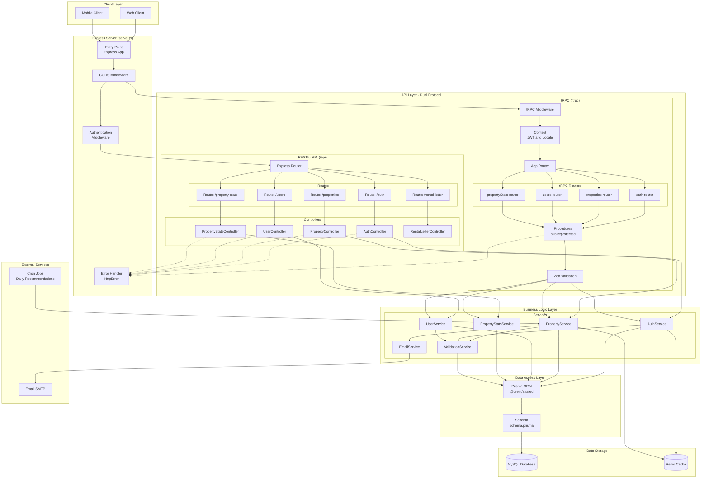

# Backend Architecture Diagram

## Prompt

packages/backend

理解并分析这些代码。

用mermaid，给backend绘制一个架构图

关键组件：restful controller，trpc route，service，prisma as orm，db

```mermaid
graph TB
    subgraph "Client Layer"
        WEB[Web Client]
        MOBILE[Mobile Client]
    end

    subgraph "Express Server (server.ts)"
        ENTRY[Entry Point<br/>Express App]
        CORS[CORS Middleware]
        AUTH[Authentication<br/>Middleware]
        ERROR[Error Handler<br/>HttpError]
    end

    subgraph "API Layer - Dual Protocol"
        subgraph "tRPC (/trpc)"
            TRPC_MW[tRPC Middleware]
            TRPC_CTX["Context<br/>JWT and Locale"]
            TRPC_ROUTER[App Router]

            subgraph "tRPC Routers"
                TRPC_AUTH[auth router]
                TRPC_PROP[properties router]
                TRPC_USER[users router]
                TRPC_STATS[propertyStats router]
            end

            TRPC_PROC["Procedures<br/>public/protected"]
            TRPC_ZOD[Zod Validation]
        end

        subgraph "RESTful API (/api)"
            REST_ROUTER[Express Router]

            subgraph "Routes"
                ROUTE_AUTH["Route: /auth"]
                ROUTE_PROP["Route: /properties"]
                ROUTE_USER["Route: /users"]
                ROUTE_STATS["Route: /property-stats"]
                ROUTE_LETTER["Route: /rental-letter"]
            end

            subgraph "Controllers"
                CTRL_AUTH[AuthController]
                CTRL_PROP[PropertyController]
                CTRL_USER[UserController]
                CTRL_STATS[PropertyStatsController]
                CTRL_LETTER[RentalLetterController]
            end
        end
    end

    subgraph "Business Logic Layer"
        subgraph "Services"
            SVC_AUTH[AuthService]
            SVC_PROP[PropertyService]
            SVC_USER[UserService]
            SVC_STATS[PropertyStatsService]
            SVC_EMAIL[EmailService]
            SVC_VALID[ValidationService]
        end
    end

    subgraph "Data Access Layer"
        PRISMA["Prisma ORM<br/>@qrent/shared"]
        SCHEMA["Schema<br/>schema.prisma"]
    end

    subgraph "Data Storage"
        DB[(MySQL Database)]
        REDIS[(Redis Cache)]
    end

    subgraph "External Services"
        SMTP[Email SMTP]
        CRON[Cron Jobs<br/>Daily Recommendations]
    end

    %% Client connections
    WEB --> ENTRY
    MOBILE --> ENTRY

    %% Middleware flow
    ENTRY --> CORS
    CORS --> TRPC_MW
    CORS --> AUTH
    AUTH --> REST_ROUTER

    %% tRPC flow
    TRPC_MW --> TRPC_CTX
    TRPC_CTX --> TRPC_ROUTER
    TRPC_ROUTER --> TRPC_AUTH
    TRPC_ROUTER --> TRPC_PROP
    TRPC_ROUTER --> TRPC_USER
    TRPC_ROUTER --> TRPC_STATS
    TRPC_AUTH --> TRPC_PROC
    TRPC_PROP --> TRPC_PROC
    TRPC_USER --> TRPC_PROC
    TRPC_STATS --> TRPC_PROC
    TRPC_PROC --> TRPC_ZOD

    %% REST flow
    REST_ROUTER --> ROUTE_AUTH
    REST_ROUTER --> ROUTE_PROP
    REST_ROUTER --> ROUTE_USER
    REST_ROUTER --> ROUTE_STATS
    REST_ROUTER --> ROUTE_LETTER
    ROUTE_AUTH --> CTRL_AUTH
    ROUTE_PROP --> CTRL_PROP
    ROUTE_USER --> CTRL_USER
    ROUTE_STATS --> CTRL_STATS
    ROUTE_LETTER --> CTRL_LETTER

    %% Controllers to Services
    CTRL_AUTH --> SVC_AUTH
    CTRL_PROP --> SVC_PROP
    CTRL_USER --> SVC_USER
    CTRL_STATS --> SVC_STATS

    %% tRPC to Services (direct)
    TRPC_ZOD --> SVC_AUTH
    TRPC_ZOD --> SVC_PROP
    TRPC_ZOD --> SVC_USER
    TRPC_ZOD --> SVC_STATS

    %% Services interactions
    SVC_PROP --> SVC_VALID
    SVC_PROP --> SVC_EMAIL
    SVC_AUTH --> SVC_VALID
    SVC_USER --> SVC_VALID

    %% Services to Prisma
    SVC_AUTH --> PRISMA
    SVC_PROP --> PRISMA
    SVC_USER --> PRISMA
    SVC_STATS --> PRISMA
    SVC_VALID --> PRISMA

    %% Prisma to DB
    PRISMA --> SCHEMA
    SCHEMA --> DB

    %% Redis connections
    SVC_AUTH --> REDIS
    SVC_PROP --> REDIS

    %% External services
    SVC_EMAIL --> SMTP
    CRON --> SVC_PROP

    %% Error handling
    TRPC_PROC -.-> ERROR
    CTRL_AUTH -.-> ERROR
    CTRL_PROP -.-> ERROR
    CTRL_USER -.-> ERROR
    CTRL_STATS -.-> ERROR
```
